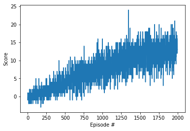
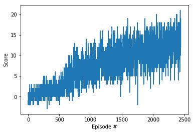
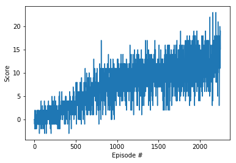

# Project 1 Navigation

### Introduction

This project is designed to train an agent using reinforcement learning through deep Q-learning nerual network. The goal of the agent is to collect as many yellow bananas while avoid blue bananas in unity ML environment. The environment is a large square world, the state space has 37 dimensions and contains the agents velocity along with ray-based perception of objects around agent's forward direction. There are 4 discrete actions avaiable and corresponding to 1. Move forward 2. Move backward 3. Turn left 4. Turn right. The task is episodic, and in order to solve the environment, the agent must get an average score of +13 over tested consecutive episodes.

### Implementaion

DQN algorithm and experience replay were used to solve this project.

### Hyperparameters
Tested different combinations, values below will allow the agent to solve the problem faster.

Hyperparameter | Value
--- | ---
Buffer size | 1e5    
Batch size | 128
Gamma | 0.99
τ | 1e-3
LR | 7e-4
UPDATE_EVERY | 4 

### DQN structure
The deep Q network consists of 1 input layer (37 state space), 2 hidden layers (64 nodes and 32 nodes), 1 output layer (4 actions space). With relu activation function. 

    # Create the architect of the neural network, the brain

    class QNetwork(nn.Module):

        def __init__(self, state_size, action_size, seed, fc1_units=64, fc2_units=32):
            super(QNetwork, self).__init__()
            self.state_size = state_size
            self.action_size = action_size
            self.fc1 = nn.Linear(state_size,    fc1_units)
            self.fc2 = nn.Linear(fc1_units, fc2_units)
            self.fc3 = nn.Linear(fc2_units, action_size)

    # Forward propogate        
        def forward(self, state):
            # Activation functions relu
            x = F.relu(self.fc1(state))
            x = F.relu(self.fc2(x))
            q_values = self.fc3(x)
            return q_values
### Results
Below is the number of episodes needed to solve the environment for DQNs

#### 1. Double Q network
    Episode 100	Average Score: 0.18
    Episode 200	Average Score: 0.73
    Episode 300	Average Score: 1.28
    Episode 400	Average Score: 2.16
    Episode 500	Average Score: 3.27
    Episode 600	Average Score: 4.51
    Episode 700	Average Score: 5.03
    Episode 800	Average Score: 6.19
    Episode 900	Average Score: 6.85
    Episode 1000	Average Score: 8.05
    Episode 1100	Average Score: 7.73
    Episode 1200	Average Score: 8.78
    Episode 1300	Average Score: 9.984
    Episode 1400	Average Score: 10.75
    Episode 1500	Average Score: 11.05
    Episode 1600	Average Score: 11.24
    Episode 1700	Average Score: 11.27
    Episode 1800	Average Score: 11.87
    Episode 1900	Average Score: 12.53
    Episode 2000	Average Score: 13.01

    Environment solved in 1900 episodes!	Average Score: 13.01

#### 2. Dropout DQN
    Episode 100	Average Score: 0.24
    Episode 200	Average Score: 0.55
    Episode 300	Average Score: 1.24
    Episode 400	Average Score: 1.22
    Episode 500	Average Score: 1.93
    Episode 600	Average Score: 2.63
    Episode 700	Average Score: 4.45
    Episode 800	Average Score: 5.59
    Episode 900	Average Score: 6.21
    Episode 1000	Average Score: 6.84
    Episode 1100	Average Score: 7.02
    Episode 1200	Average Score: 8.43
    Episode 1300	Average Score: 8.68
    Episode 1400	Average Score: 8.86
    Episode 1500	Average Score: 9.40
    Episode 1600	Average Score: 10.07
    Episode 1700	Average Score: 10.00
    Episode 1800	Average Score: 10.72
    Episode 1900	Average Score: 10.70
    Episode 2000	Average Score: 11.32
    Episode 2100	Average Score: 11.42
    Episode 2200	Average Score: 11.73
    Episode 2300	Average Score: 12.20
    Episode 2400	Average Score: 12.64
    Episode 2444	Average Score: 13.06
    Environment solved in 2344 episodes!	Average Score: 13.06

#### 3. Duel DQN
    Episode 100	Average Score: 0.26
    Episode 200	Average Score: 0.75
    Episode 300	Average Score: 0.79
    Episode 400	Average Score: 2.05
    Episode 500	Average Score: 2.68
    Episode 600	Average Score: 3.59
    Episode 700	Average Score: 4.80
    Episode 800	Average Score: 5.97
    Episode 900	Average Score: 7.13
    Episode 1000	Average Score: 6.85
    Episode 1100	Average Score: 8.23
    Episode 1200	Average Score: 8.66
    Episode 1300	Average Score: 9.43
    Episode 1400	Average Score: 9.46
    Episode 1500	Average Score: 9.740
    Episode 1600	Average Score: 10.13
    Episode 1700	Average Score: 10.36
    Episode 1800	Average Score: 10.51
    Episode 1900	Average Score: 11.41
    Episode 2000	Average Score: 12.03
    Episode 2100	Average Score: 11.97
    Episode 2200	Average Score: 12.28
    Episode 2248	Average Score: 13.01
    Environment solved in 2148 episodes!	Average Score: 13.01

#### 4. Single DQN
    Episode 100	Average Score: 0.21
    Episode 200	Average Score: 0.52
    Episode 300	Average Score: 1.54
    Episode 400	Average Score: 2.21
    Episode 500	Average Score: 3.50
    Episode 600	Average Score: 4.48
    Episode 700	Average Score: 5.54
    Episode 800	Average Score: 6.35
    Episode 900	Average Score: 7.07
    Episode 1000	Average Score: 8.14
    Episode 1100	Average Score: 8.82
    Episode 1200	Average Score: 8.84
    Episode 1300	Average Score: 9.82
    Episode 1400	Average Score: 9.971
    Episode 1500	Average Score: 10.34
    Episode 1600	Average Score: 10.52
    Episode 1700	Average Score: 10.70
    Episode 1800	Average Score: 11.10
    Episode 1900	Average Score: 11.43
    Episode 2000	Average Score: 12.58
    Episode 2100	Average Score: 12.58
    Episode 2125	Average Score: 13.05
    Environment solved in 2025 episodes!	Average Score: 13.05

 

### Ideas for future improvements

1. Implement prioritized experience replay in order to learn the experience where there is a big difference between predicted and the TD target, it means the agent can learn a lot from it.

2. Implement Fixed Q-tagets to learn faster since the target value will not shift with the Q values.

3. Implement Double DQNs to handle the problem of the overestimation of Q-values (the non-optimal actions are regularly given a higher Q value than the optimal best action, the learning will be complicated).

4. Implement Dueling DQN to calculate how good it is to be at that state and taking an action at that state Q(s, a), one DQN will estimate the state values V(s) and one will estimate the advantage for each actions A(s,a)

5. Better hyperparameteres and extracted features to optimize computing time and learning speed

6. Implement actor-critic and A3C algorithm and convert to policy gradient method to directly get weights from the DQN

7. Add dropout for DQN to prevent overfitting

8. Combine different improments methods to achieve better result